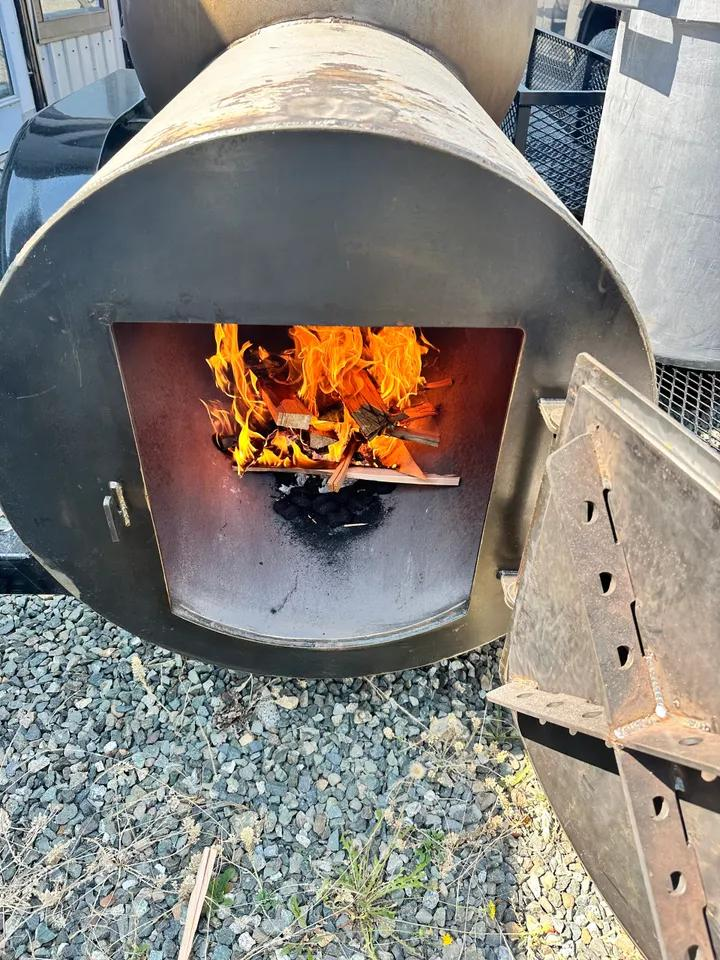

# Project

## Step 1

### Project Summary

The client I chose to rededisgn is [Big Brisket Barbecue](https://bigbrisketbarbecue.com/).

The most important purpose of this website is to provide information to potential and returning customers, in a clear and concise manner.  
The current website's layout feels awkward and forced, especially for the projected target audience which would include an older, less tach savvy crowd. So accessibilty, speed and responsivness are of top priorty.  
The overall message that should be conveyed to the target audience is that Big Brisket is the best option for their barbecue needs.  
We want the audience to reach out to us or at least keep us in their minds for future, to do this we can add an subscription form that will add clients to an email list to alert for upcomming sales.  
We will also want links to the social media pages for the customers to follow, and get continuos reminders about Big Brisket.  
The current site falls short with the design and content, and has plenty of room for improvement around responsiveness and accessibility.

### Look and Feel

The overall mood the site should convey is an early fall barbecue with your favourite people. So inviting, cozy, and homey.  
The original site didn't appear to have a set color scheme, so I chose three colors akin to those used in the original sites logo.

 .

I've selected a handful of images to be used from the original site, as well as new images to be used.  
The original website didn't seem to have a cohesieve brand font, in my redesign I will be using Archivo as my headline font and Mona Sans as the body copy.

### Content Lists

#### Home Page

> **Header**
>
> - Logo
> - Main Navigation
> - Home Page
> - Menu Page
> - Services Page

> **Hero**
>
> - Heading "Big Brisket, Bigger Flavor - Smoked to perfection and served with a smile"
> - Image
>   .
> - Link to Menu page

> **About**
>
> - Heading "Who we are"
> - Paragraph describing who Big Brisket is
> - Image of client

> **Benefits**
>
> - Heading "Why choose us"
> - List of Reasons:
>   - Many years of quality dining experience
>   - Prioritize local, high quality fresh ingredients
>   - Slow smoking over real wood for our signature flavor and tenderness.
> - Link to Services page

> **Call-to-action**
>
> - Heading "Indulge the way you want"
> - Link to Services page and Menu page
> - Contact Us form

> **Footer**
>
> - Social media links
> - Contact info
> - Business hours
> - copyright information

#### Menu Page

> **Header**
>
> - Same as Home

> **Hero**
>
> - Heading "Experience the best barbecue brisket in the Comox Valley"
> - Image:  
>   

> **Menu Section**
>
> - Handhelds
> - Brisket Slices
> - Poutine
> - Sides
> - Beverages
> - Frozens

> **Footer**
>
> - Same as Home

#### Services Page

> **Header**
>
> - Same as Home

> **Hero**
>
> - Header "More than _meats_ the eye!"
> - Image:  
>   

> **Smoker Rentals**
>
> - Heading "Rent our smoker"
> - Image:  
>   
> - Paragraph on how to rent the smoker and the best ocaisions to do so

> **Custom Orders**
>
> - Heading "You want the best at your next event?"
> - Image:
>   
> - Paragraph on how to and when to submit custom orders

> **Call-to-action**
>
> - Same as Home

> **Footer**
>
> - Same as Home
